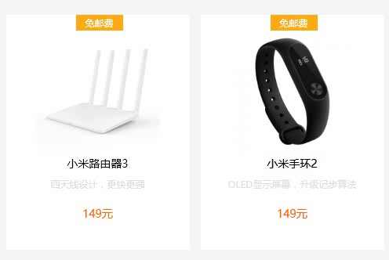

# my_project
# 仿制小米商城 [链接](http://haoniansheng.applinzi.com)
## 项目功能
### 1 页面轮播

### 2 商品展示

### 3 商品购买

#### 进入方式 
#### 首页的小米手机菜单

### 4 注册用户名实时查重
#### 表单验证还比较简陋

### 5 全屏轮播展示 [快速链接](http://haoniansheng.applinzi.com/MIX.html)

#### 进入方式 
#### 商品详情下方的MIX详情介绍

## 工作日志
### 2017.1.9 明星商品轮播完成

### 1.10 为您推荐轮播完成

### 1.12 个别商品hover时向上浮动信息完成

### 1.17上方菜单

### 1.19 视频弹出遮罩层处理

### 2.7 5s详情页静态完成 使用less

### 2.9 引入Angular 实现参数弹出弹入显示

### 2.13 详情页轮播完成 使用swiper

### 2.15 添加MIX页面的绑定鼠标滚轮函数,可以根据页面位置添加属性
#### 看了一下fullpage.js 的样式

### 2.16 完成鼠标滚轮向下滚动一定距离  顶栏过度下沉显示
#### 玩了一下three.js

### 2.20 开始做首页的视频功能 利用HTML5 <video>标签 实现暂停等功能
 
### 3.6 MIX全屏轮播结构完成 淡入淡出加载完成

### 3.9 登录页面完成 登陆注册功能完成

### 3.10 详情页完成 购物车添加完成